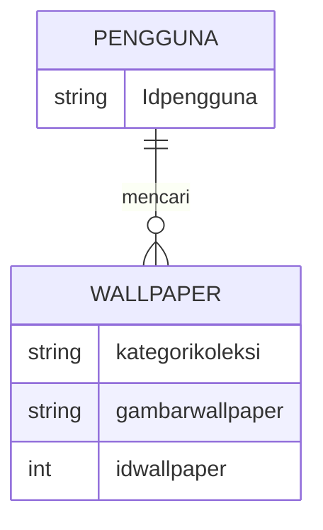

## Membuat aplikasi e-library (perpustakaan digital) dengan figma, java swinhg, Netbeans, MySQL
Idha Hamidaturrosadi 24 Oktober 2023

## Latar Belakang
Dengan perkembangan teknologi dan kebutuhan akses informasi yang lebih luas, e-library ini menjadi solusi untuk memberikan akses mudah dan cepat ke berbagai sumber daya digital. Perpustakaan digital ini bisa mengaksesnya  dari mana saja, mengatasi batasan fisik, dan menyediakan fleksibilitas dalam pencarian dan pembelajaran. Pandemi COVID-19 ini juga melatarbelakangi e-library dibuat karena keliatannya jadi akan lebih fleksibel dan mempercepat transformasi digital dalam sektor pendidikan dan perpustakaan. Oleh karena itu, pembangunan e-library menjadi penting untuk memenuhi kebutuhan kita khususnya sebagaia mahasiswa.

## Deskripsi
Perpustakaan digital (E – Library) adalah tempat di mana kita dapat membaca koleksi buku dan sumber edukatif lainnya secara online. Di era sekarang ini, perpustakaan digital sudah umum dimiliki oleh setiap lembaga pendidikan atau organisasi, seperti yang ada di kampus kita yaitu Digital Library UIN Sunan Gunung Djati. E-library ini dibuat agar orang yang rata-rata tidak mampu membeli buku sekian banyaknya  bisa tetap membaca dan dapat memberikan,kemudahan, praktis dan tidak terbatas oleh waktu dan tempat. Motivasi saya membuat app ini yaitu sebagai sumber edukasi, karena menurut saya membaca itu adalah hal yang penting, apalagi bagi kita sebagai mahasiswa agar dapat memperoleh banyak pengetahuan dan informasi juga memberikan pengalaman belajar dan penelitian yang lebih baik.

## Analysis : Branding

Pada tahap ini kita mengeksplorasi branding dari sistem yang dibuat. Branding meliputi:

•  Merk: Enjoyread

•  Tagline: happy membaca serta mendapat informasi/pengetahuan dan tentunya mudah digunakan oleh semua kalangan. 

•  Campaign: Bagaimana membuat aplikasi yang membuat penggunanya jadi banyak mengetahui segala hal/pengetahuan, serta happy saat membaca karena desainnya tidak terlalu formal

•  Target user:

o  Usia 12+

o  Seorang yang senang mencari inspirasi dan informasi baru

o  Seorang yang senang membaca tapi praktis

o  Seorang yang ingin mendapatkan pengetahuan banyak

o  Seorang yang senang membaca lewat gadget

o  Seorang yang kurang mampu membeli buku, tapi berkeinginan/excited untuk membaca

•  User experience theme:

o  Mudah

o  Memberikan banyak pengetahuan(knowladge)

o  Simpel

o  Menyenangkan

o  Warna: Lime fizz

o  Inspirasi desain:


## Analysis User Story :

Pada tahap ini kita mengeksplorasi kebutuhan prioritas dari para pengguna untuk kita wujudkan sebagai fitur pada sistem atau aplikasi yang akan dibuat. User story ini memudahkan kita membuat prioritas fitur-fitur untuk dikerjakan untuk jangka waktu tertentu.

| No | Sebagai |  Saya ingin bisa | Sehingga | Prioritas |
|----|---------|------------------|----------|-----------|
|1|Pengguna |Mencari buku berdasarkan judul, penulis, atau kategori|Saya bisa dengan mudah menemukan buku yang saya cari| ⭐⭐⭐⭐⭐ |
|2|Pengguna |Menyimpan daftar buku yang ingin saya baca di dalam aplikasi|Saya tidak lupa buku mana yang ingin dibaca berikutnya| ⭐⭐⭐⭐⭐ |
|3|Pengguna |Memiliki opsi untuk meminjam buku secara digital atau fisik|Kemudian bisa melacak tanggal pengembalian buku tersebut| ⭐⭐⭐⭐ |
|4|Pengguna |Melihat daftar buku populer atau baru yang ditambahkan ke perpustakaan|Saya bisa tetap up-to-date dengan koleksi perpustakaan| ⭐⭐⭐⭐⭐ |
|5|Pengguna |Saya ingin dapat mengakses buku-buku digital atau e-book|Bisa membacanya langsung melalui aplikasi| ⭐⭐⭐ |
|6|Pengguna |Memiliki opsi untuk memberikan ulasan atau peringkat buku yang sudah saya baca|Pengguna lain dapat mendapatkan rekomendasi| ⭐⭐ |
|7|Pengguna |Memiliki opsi untuk melihat detail buku, termasuk sinopsis, penulis, ulasan, dan informasi lainnya|Saya bisa mengetahuinya sebelum saya meminjam atau membeli buku tersebut| ⭐⭐⭐⭐ |
|8|Pengguna |Menerima pemberitahuan atau peringatan ketika batas waktu pengembalian buku hampir habis|Saya tidak melewatkan kesempatan untuk membacanya| ⭐⭐⭐⭐ |
|9|Pengguna |Mengatur notifikasi tentang acara khusus, promosi, atau perubahan dalam layanan perpustakaan|Saya  bisa mengetahuinya| ⭐ |
|10|Pengguna |Melihat acara atau program yang diadakan oleh perpustakaan, seperti pertemuan buku|Mendaftar untuk acara tersebut| ⭐⭐⭐⭐ |
|11|Pengguna |Memiliki opsi untuk mendaftar sebagai anggota perpustakaan melalui aplikasi|Bisa menjadi anggota perpustakaan dan dapat mengelola data anggota saya| ⭐⭐⭐ |
|12|Pengguna |Memiliki fitur baca bersama yang memungkinkan saya untuk bergabung dengan kelompok pembaca lainnya|Kami bisa berdiskusi tentang buku yang sedang kami baca| ⭐⭐⭐⭐⭐ |
|13|Pengguna |Mengakses perpustakaan saya secara offline|Dapat membaca buku tanpa koneksi internet| ⭐⭐ |
|14|Pengguna |Memiliki fitur penyimpanan bookmark yang memungkinkan saya untuk menandai halaman|Saya dapat dengan mudah kembali ke tempat yang saya tinggalkan| ⭐⭐⭐⭐⭐ |
|15|Pengguna |Menerima rekomendasi buku berdasarkan minat saya dan histori bacaan saya|Saya dapat menemukan buku-buku baru yang menarik| ⭐⭐⭐⭐ |

## Analysis : Structure Data


•  Pada tahap ini kita mengeksplorasi dan menganalisis bentuk struktur data yang mampu memfasilitasi user story yang ada, maupun yang kemungkinan besar dibutuhkan di kemudian hari
•  Kita akan merepresentasikan Entitas pada aplikasi dalam bentuk tabel Entitas dan Atribut


erDiagram
  PENGGUNA {
    int id_pengguna
    string username
    string email
    string password
    string nama_lengkap
  }
  PENGGUNA ||--o{ CUITAN : membuat
  CUITAN ||--o{ CUITAN : membalas 
  CUITAN {
    int id_cuitan
    int id_cuitan_yang_dibalas
    int id_pengguna 
    string isi_cuitan 
    datetime waktu_publikasi 
  }
  PENGGUNA ||--o{ PENGIKUT : memiliki
  PENGGUNA ||--o{ PENGIKUT : mengikuti
  PENGIKUT {
    int id_pengguna
    int id_pengguna_yang_mengikuti
  }


## Design : Arsitektur Berbasis Client-Server
Pada tahap ini kita merancang arsitektur berikut teknologi yang terdapat pada setiap komponen pembentuk aplikasi.


```mermiad
flowchart BT 
  subgraph cloud
    B[Web Server: JavaScript - Express.js] <--> C[Aplikasi Web Backend: JavaScript - Express.js] 
    C <--> D[Database: MySQL] 
  end
  A[Aplikasi Android : JavaScript ] <--> B
```


## Deskripsikan teknologi, library, dan framework apa saja yang kamu gunakan dalam membangun produk ini !
Teknologi Basis Data (Database Technology):

Sistem Manajemen Basis Data (Database Management System - DBMS): Untuk menyimpan, mengelola, dan mengindeks metadata dan konten digital. Beberapa DBMS yang umum digunakan adalah MySQL, PostgreSQL, MongoDB, atau Oracle.
Bahasa Pemrograman:

Bahasa Pemrograman Server: Bahasa seperti Python, Ruby, Java, atau Node.js digunakan untuk mengembangkan bagian server dari aplikasi e-library.
Bahasa Pemrograman Klien: HTML, CSS, dan JavaScript digunakan untuk mengembangkan antarmuka pengguna (UI/UX).
Framework Web:

Framework Front-end: Framework seperti React, Angular, atau Vue.js sering digunakan untuk membangun antarmuka pengguna yang responsif dan dinamis.
Framework Back-end: Framework seperti Ruby on Rails, Django, atau Express.js digunakan untuk membangun logika bisnis, mengelola permintaan pengguna, dan berinteraksi dengan basis data.
Sistem Operasi:

Pemilihan sistem operasi seperti Linux, Windows, atau macOS tergantung pada preferensi dan kebutuhan teknis.
Penyimpanan Konten Digital:

Penyimpanan File: File digital seperti e-books, jurnal, dan lainnya perlu disimpan dengan aman. Teknologi penyimpanan seperti Amazon S3, Google Cloud Storage, atau penyimpanan lokal dapat digunakan.
Teknologi Pencarian:

Mesin Pencari (Search Engine): Untuk memungkinkan pengguna mencari dan menemukan sumber informasi dengan cepat. Elasticsearch atau Apache Solr adalah opsi yang populer.
Keamanan:

Teknologi Keamanan: Untuk melindungi data pengguna, enkripsi SSL/TLS, autentikasi pengguna, otorisasi, dan perlindungan terhadap ancaman siber diperlukan.
API (Application Programming Interface):

API digunakan untuk mengintegrasikan e-library dengan sumber data eksternal, seperti penyedia konten digital eksternal atau perangkat lunak manajemen referensi.
Pustaka dan Standar:

Menggunakan pustaka dan standar seperti MARC (Machine-Readable Cataloging), Dublin Core, atau Resource Description Framework (RDF) untuk mengelola metadata.
Konten Digital:

Diperlukan sumber daya digital seperti buku elektronik, jurnal, makalah, tesis, dan materi lainnya yang akan diintegrasikan ke dalam e-library.
Sistem Manajemen Lisensi:

Untuk mengelola akses berbayar atau berlangganan ke konten premium dan berbagai jenis lisensi.
Penanganan Data Pribadi dan Kepatuhan:

Penerapan kepatuhan seperti GDPR (General Data Protection Regulation) untuk melindungi data pribadi pengguna.
Pemantauan Kinerja dan Analitik:

Pemantauan kinerja sistem dan analitik pengguna untuk memahami bagaimana pengguna berinteraksi dengan e-library.
Sistem Manajemen Konten (CMS):

Untuk mengelola dan memperbarui konten pada situs web e-library.
Pengembangan Aplikasi Seluler (Opsional):

Jika perlu, pengembangan aplikasi seluler untuk platform seperti iOS dan Android dapat menjadi bagian dari strategi e-library.

## Design : User Experience (UX) Design
•  Pada tahap ini kita mengeksplorasi alur interaksi pengguna yang paling praktis dan efektif untuk setiap fitur.
•  Ada banyak tools yang bisa digunakan mulai dari yang open source seperti Inkscape (yang saya gunakan), Penpot, lalu yang gratis hingga berbayar seperti Figma.
•  Desain yang dibuat di atas adalah low fidelity design dimana kualitas desainnya paling sederhana tapi cepat untuk dibuat.


